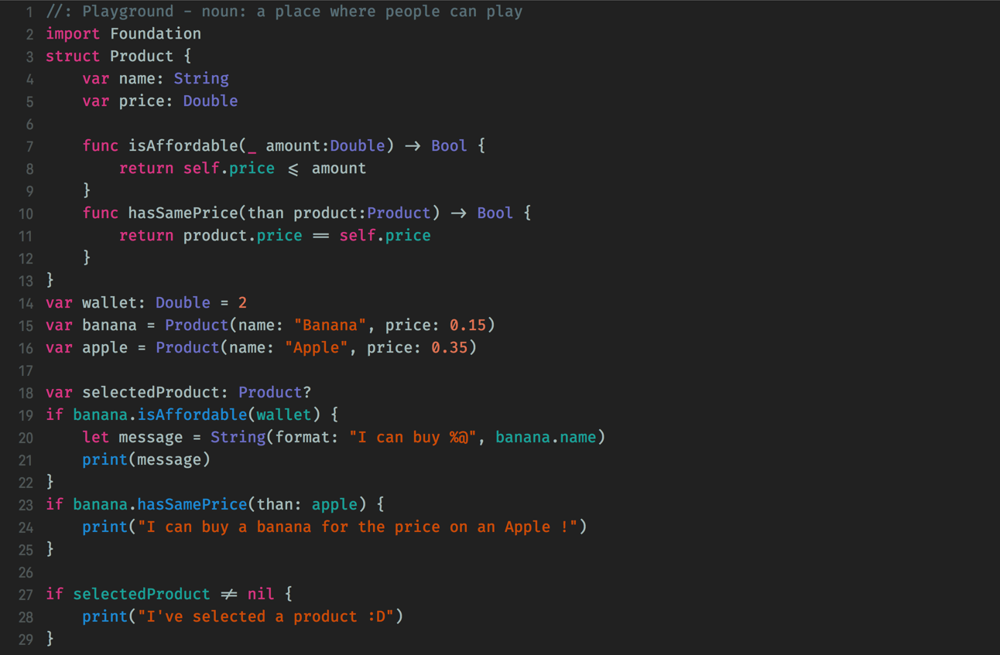

# 🎨 My Xcode theme - FiraCode and Sundell's Colors

This repository contains the Xcode theme that I use. Fork from [Julien Quéré's theme](https://github.com/jlnquere/XcodeTheme), it's based on [John Sundell's theme](https://github.com/JohnSundell/XcodeTheme), but uses the awesome [FiraCode font](https://github.com/tonsky/FiraCode).

Feel free to use it or modify it to your liking 👍



## Installing using Marathon

If you already have [Marathon](https://github.com/johnsundell/marathon) on your Mac, the easiest way to install this theme is to run the install script. It will install [FiraCode](https://github.com/tonsky/FiraCode) font & this Xcode theme for you:

```
$ marathon run Flo5929/xcodetheme
```

If you want to install [Marathon](https://github.com/johnsundell/marathon), you can use homebrew:
```
$ brew install marathon-swift
```


## Installing manually

You can also choose to do things manually if you want:

1. Clone this repo:
```
$ git clone https://github.com/Flo5929/xcodetheme.git
```

2. Create a folder at this path if it doesn't exist already:
```
~/Library/Developer/Xcode/UserData/FontAndColorThemes
```

3. Copy the file `SundellsFiraColors.xccolortheme` into the above folder.

4. Download the latest release of Fira Code from [its repo](https://github.com/tonsky/FiraCode).

5. Unzip the font archive and move the files in the `TTF` folder to `~/Library/Fonts`.


## Attributions

This Xcode theme is based on [John Sundell's work](https://github.com/JohnSundell/XcodeTheme). As he said, this is the result of a long series of tweaking: 

> This Xcode theme is the result of years of tweaks and modifications to some version of a "Solarized" theme. I have no idea where I got the
original material for this theme from, but if you recognize some aspect of this theme as coming from something you made, feel free to open
an issue and I'll gladly add attributions to you 🙂
